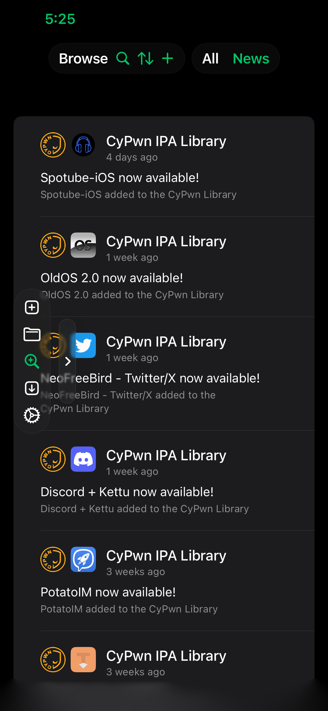

# MySign

The coolest ipa signer on the planet, for iOS 15 to 26. 

## Credits

- [ArkSigning](https://github.com/nabzclan-reborn/ArkSigning): Improved zsign fork for on device signing and ipa modification
- [Circlefy](https://github.com/AppInstalleriOSGH/Circlefy): Allows for transparent/circle cropped app icons
- [Santander](https://github.com/NSAntoine/Santander): Modern Filza alternative 
- [Feather](https://github.com/khcrysalis/Feather): Ipa signer used only for importing eSign repos (MySign is not a Feather fork)

## Screenshots

  
  

## License
You can use the code however you want just give credit.
